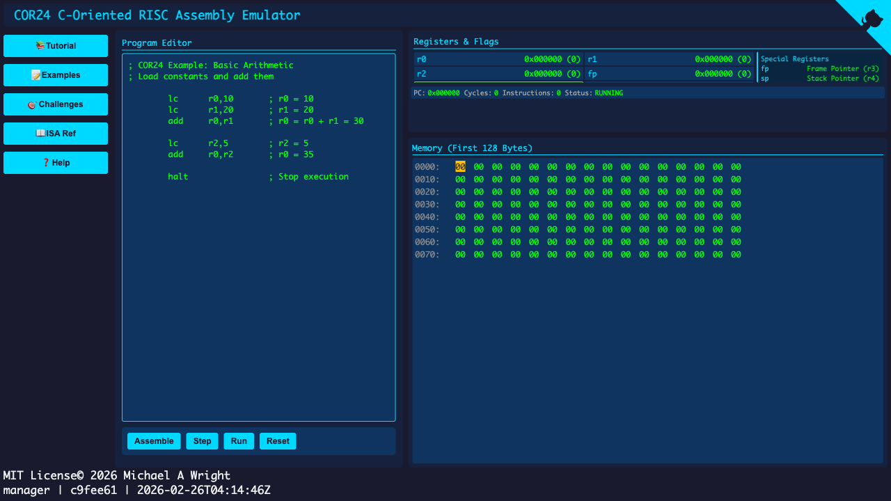

# COR24 Assembly Emulator

A browser-based educational emulator for the COR24 (C-Oriented RISC 24-bit) assembly architecture. Written in Rust and compiled to WebAssembly.

**[Live Demo](https://sw-embed.github.io/cor24-rs/)**



## Features

- **Interactive Assembly Editor** - Write and edit COR24 assembly code
- **Step-by-Step Execution** - Debug your code instruction by instruction
- **Register & Memory Viewer** - Watch CPU state change in real-time
- **Built-in Examples** - Learn from pre-loaded example programs
- **Challenges** - Test your assembly skills with programming challenges
- **ISA Reference** - Complete instruction set documentation

## COR24 Architecture

COR24 is a simplified 24-bit RISC architecture designed for teaching:

- **8 General-Purpose Registers**: r0-r7 (24-bit)
  - r3 = fp (frame pointer)
  - r4 = sp (stack pointer)
  - r5 = z (zero/condition)
  - r6 = iv (interrupt vector)
  - r7 = ir (interrupt return)
- **Single Condition Flag**: C (set by compare instructions)
- **64KB Address Space**: Byte-addressable memory
- **Variable-Length Instructions**: 1-4 bytes

### Supported Instructions

| Category | Instructions |
|----------|-------------|
| Arithmetic | `add`, `sub`, `mul` |
| Logic | `and`, `or`, `xor` |
| Shifts | `shl`, `sra`, `srl` |
| Compare | `ceq`, `cls`, `clu` |
| Branch | `bra`, `brf`, `brt` |
| Jump | `jmp`, `jal` |
| Load | `la`, `lc`, `lcu`, `lb`, `lbu`, `lw` |
| Store | `sb`, `sw` |
| Stack | `push`, `pop` |
| Move | `mov`, `sxt`, `zxt` |

## Building

### Prerequisites

- [Rust](https://rustup.rs/) (1.75+)
- [Trunk](https://trunkrs.dev/) (`cargo install trunk`)
- wasm32-unknown-unknown target (`rustup target add wasm32-unknown-unknown`)

### Development

```bash
# Serve locally with hot reload
trunk serve

# Open http://localhost:7777
```

### Production Build

```bash
# Build optimized WASM to pages/
trunk build --release
```

## Project Structure

```
cor24-rs/
├── src/
│   ├── cpu/           # CPU emulator core
│   │   ├── decode_rom.rs  # Instruction decode ROM (from hardware)
│   │   ├── encode.rs      # Instruction encoding tables
│   │   ├── executor.rs    # Instruction execution engine
│   │   ├── instruction.rs # Opcode definitions
│   │   └── state.rs       # CPU state management
│   ├── assembler.rs   # Two-pass assembler
│   ├── challenge.rs   # Challenge definitions
│   └── app.rs         # Yew web application
├── components/        # Reusable UI components
├── styles/            # CSS stylesheets
├── scripts/           # Build/extraction scripts
└── references/        # Hardware reference files
```

## Testing

```bash
cargo test
```

## License

MIT License - see [LICENSE](LICENSE)

## Acknowledgments

- COR24 architecture designed for embedded systems education
- Decode ROM extracted from original hardware Verilog
