# COR24-TB Development Board Comparison (Visual Edition)

## Introduction

This document provides visual comparisons of the COR24-TB FPGA development board against popular microcontroller and single-board computer platforms using Mermaid diagrams and formatted tables.

---

## COR24-TB Quick Specs

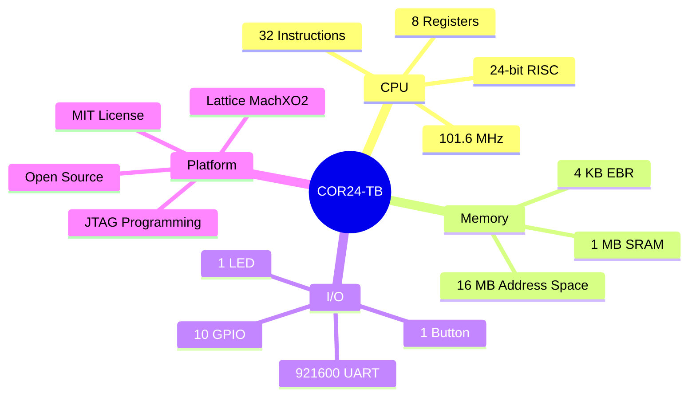

---

## Clock Speed Comparison

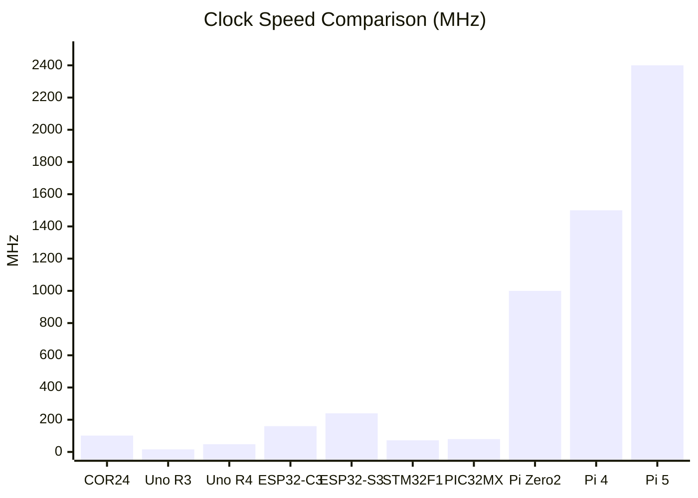

---

## Performance Tiers

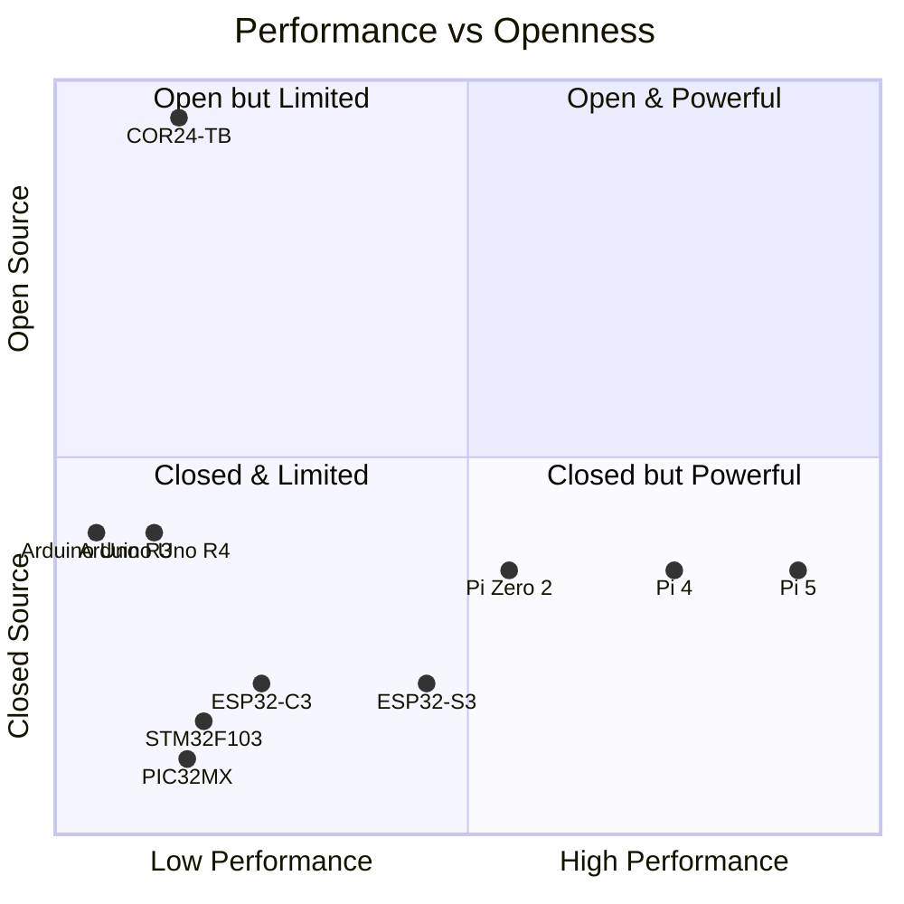

---

## Architecture Family Tree

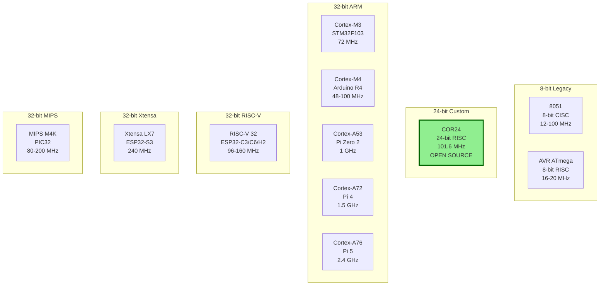

---

## Memory Comparison (Log Scale)

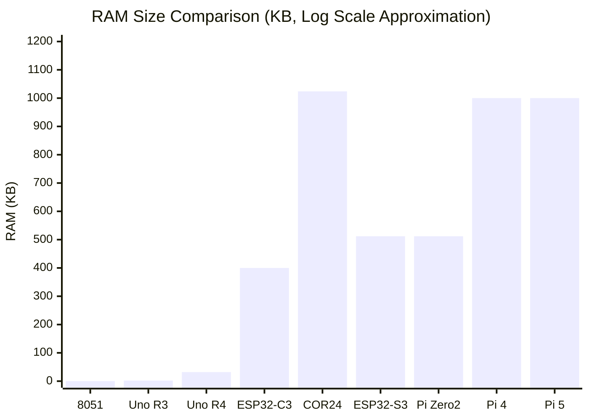

*Note: Pi Zero 2 = 512MB, Pi 4 = 2-8GB, Pi 5 = 4-16GB (shown capped for scale)*

---

## Feature Matrix

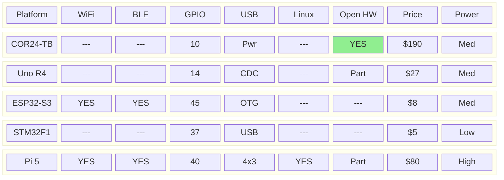

---

## Connectivity Comparison

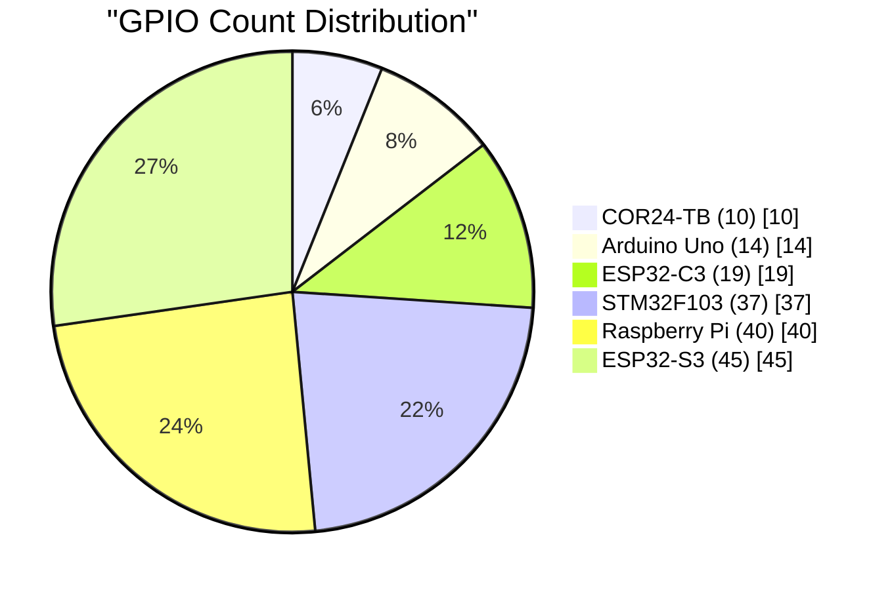

---

## Use Case Decision Tree

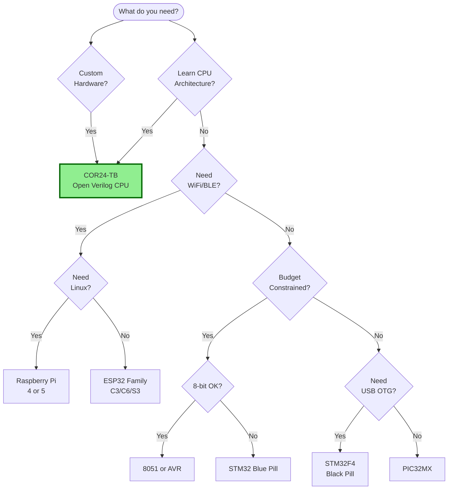

---

## Detailed Comparison Tables

### Processing Power

| Platform | Arch | Bits | Cores | MHz | MIPS | Category |
|:---------|:----:|:----:|:-----:|----:|-----:|:---------|
| **COR24-TB** | Custom RISC | 24 | 1 | 101.6 | ~40 | Soft CPU |
| Arduino Uno R3 | AVR | 8 | 1 | 16 | 16 | Classic |
| Arduino Uno R4 | ARM Cortex-M4 | 32 | 1 | 48 | 50 | Modern |
| Arduino Nano ESP32 | Xtensa LX7 | 32 | 2 | 240 | 400+ | WiFi |
| ESP32-C3 | RISC-V | 32 | 1 | 160 | 160 | WiFi |
| ESP32-C6 | RISC-V | 32 | 1 | 160 | 160 | WiFi 6 |
| ESP32-H2 | RISC-V | 32 | 1 | 96 | 96 | Thread |
| ESP32-S3 | Xtensa LX7 | 32 | 2 | 240 | 400+ | AI/ML |
| STM32F103 | ARM Cortex-M3 | 32 | 1 | 72 | 90 | Dev |
| STM32F411 | ARM Cortex-M4F | 32 | 1 | 100 | 125 | Dev |
| PIC32MX | MIPS M4K | 32 | 1 | 80 | 83 | Classic |
| PIC32MZ | MIPS M-Class | 32 | 1 | 200 | 330 | Hi-Perf |
| 8051 Classic | CISC | 8 | 1 | 12 | 1 | Legacy |
| Pi Zero 2 W | ARM Cortex-A53 | 64 | 4 | 1000 | 2000+ | Linux |
| Raspberry Pi 4 | ARM Cortex-A72 | 64 | 4 | 1500 | 5000+ | Linux |
| Raspberry Pi 5 | ARM Cortex-A76 | 64 | 4 | 2400 | 10000+ | Linux |

### Memory

| Platform | RAM | Flash | Address Space |
|:---------|----:|------:|:--------------|
| **COR24-TB** | 1 MB + 4 KB | External | 16 MB (24-bit) |
| Arduino Uno R3 | 2 KB | 32 KB | 64 KB |
| Arduino Uno R4 | 32 KB | 256 KB | 4 GB |
| ESP32-C3 | 400 KB | 4 MB | 4 GB |
| ESP32-S3 | 512 KB + 8 MB | 16 MB | 4 GB |
| STM32F103 | 20 KB | 64 KB | 4 GB |
| PIC32MX | 128 KB | 512 KB | 4 GB |
| 8051 | 128 B | 4 KB | 64 KB |
| Pi Zero 2 W | 512 MB | SD | 4+ GB |
| Raspberry Pi 4 | 8 GB | SD | 16+ GB |
| Raspberry Pi 5 | 16 GB | SD | 16+ GB |

### Connectivity & I/O

| Platform | WiFi | BLE | GPIO | UART | I2C | SPI | USB |
|:---------|:----:|:---:|-----:|-----:|----:|----:|:----|
| **COR24-TB** | - | - | 10 | 1 | BB | BB | Power |
| Arduino Uno R4 | - | - | 14 | 1 | 1 | 1 | CDC |
| ESP32-C3 | 4 | 5.0 | 19 | 2 | 1 | 3 | Yes |
| ESP32-C6 | 6 | 5.3 | 19 | 2 | 1 | 1 | Yes |
| ESP32-S3 | 4 | 5.0 | 45 | 3 | 2 | 4 | OTG |
| STM32F103 | - | - | 37 | 3 | 2 | 2 | Yes |
| Pi 5 | ac | 5.0 | 40 | 6 | 6 | 7 | 4x USB3 |

*BB = Bit-bang (software implementation)*

### Price & Power

| Platform | Voltage | Current | Sleep | Price |
|:---------|--------:|--------:|------:|------:|
| **COR24-TB** | 5V | 75 mA | N/A | $190 |
| Arduino Uno R4 | 5V | 100 mA | 100 uA | $27 |
| ESP32-C3 | 3.3V | 80 mA | 5 uA | $4 |
| ESP32-S3 | 3.3V | 100 mA | 7 uA | $7 |
| STM32F103 | 3.3V | 25 mA | 2 uA | $4 |
| 8051 | 5V | 20 mA | 1 uA | $2 |
| Pi Zero 2 | 5V | 300 mA | N/A | $15 |
| Pi 5 | 5V | 1500 mA | N/A | $80 |

---

## COR24 Unique Value Proposition

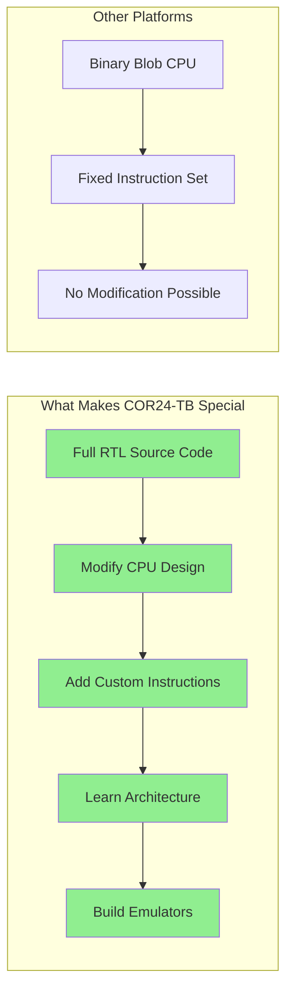

---

## Historical Context

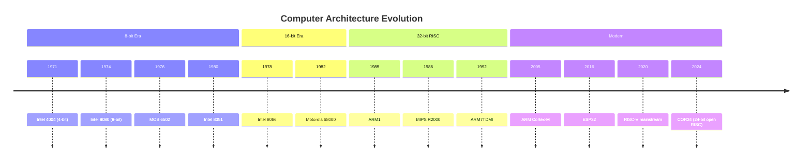

---

## Summary Radar Chart

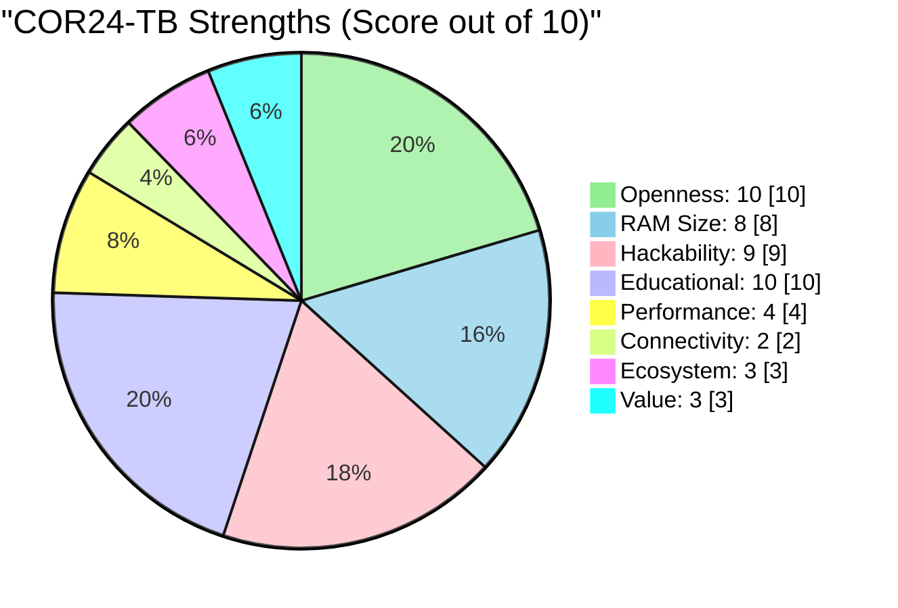

---

## Price Positioning

At **$190**, the COR24-TB is positioned as a premium educational/development tool:

| Platform | Price | Price Ratio vs COR24-TB |
|:---------|------:|:-----------------------:|
| ESP32-C3 | $4 | 47x cheaper |
| STM32 Blue Pill | $4 | 47x cheaper |
| Seeed XIAO | $7 | 27x cheaper |
| Arduino Uno R4 | $27 | 7x cheaper |
| Raspberry Pi 5 (8GB) | $80 | 2.4x cheaper |
| **COR24-TB** | **$190** | **Baseline** |

**Why the premium?** Low-volume production, hand assembly, niche market, and the unique value of a fully open-source CPU design.

---

## Files Generated

| File | Format | Purpose |
|:-----|:-------|:--------|
| `cor24-comparison.md` | Markdown | Original detailed analysis |
| `cor24-comparison-visual.md` | Markdown + Mermaid | This file with diagrams |
| `cor24-comparison.csv` | CSV/Spreadsheet | Raw data for Excel/Sheets |

---

## Sources

- [MakerLisp COR24-TB](https://www.makerlisp.com/cor24-test-board)
- [Arduino Documentation](https://docs.arduino.cc/)
- [Raspberry Pi Specifications](https://www.raspberrypi.com/products/)
- [ESP32 Comparison Guide](https://www.espboards.dev/blog/esp32-soc-options/)
- [STM32 Blue Pill](https://stm32-base.org/boards/STM32F103C8T6-Blue-Pill.html)
- [PIC32 Architecture](https://www.microchip.com/en-us/products/microcontrollers/32-bit-mcus/pic32m)
